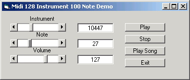



## MiDi BEST and Simplest

### Description

Allows the user to play any of the 100 midi notes with any of the 126 instruments at any volume, duration or note group (song) with less then 50 lines of code.
 
### More Info
 
Command Buttons or code

Any MiDI Music

             |
---                |---
**Submitted On**   |2007-11-17 20:53:42
**By**             |[scott93727](https://github.com/Planet-Source-Code/PSCIndex/blob/master/ByAuthor/scott93727.md)
**Level**          |Intermediate
**User Rating**    |5.0 (10 globes from 2 users)
**Compatibility**  |VB 6\.0
**Category**       |[Complete Applications](https://github.com/Planet-Source-Code/PSCIndex/blob/master/ByCategory/complete-applications__1-27.md)
**World**          |[Visual Basic](https://github.com/Planet-Source-Code/PSCIndex/blob/master/ByWorld/visual-basic.md)
**Archive File**   |[MiDi\_BEST\_20911611182007\.zip](https://github.com/Planet-Source-Code/scott93727-midi-best-and-simplest__1-69644/archive/master.zip)

